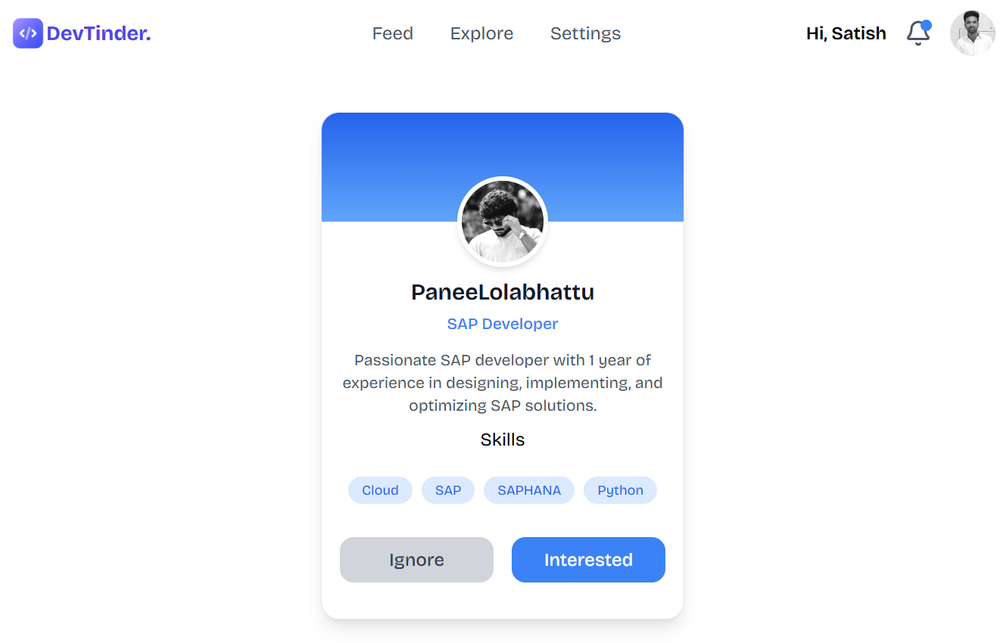

# DevTinder

DevTinder is a platform built for developers to connect, collaborate, and grow together. Whether you're looking for teammates, mentors, or networking opportunities, DevTinder has you covered.




## 🔥 Features

- **User Authentication**: Sign up, login, and manage profiles.
- **Profile Management**: Users can update their bio, skills, and experience.
- **Developer Matching**: Find and connect with like-minded developers.
- **Connection Requests**: Send and accept/reject connection requests.
- **Real-time Updates**: Get notifications when a match is made.

## 🛠 Tech Stack

- **Backend**: Node.js, Express.js
- **Database**: MongoDB, Mongoose
- **Authentication**: JWT (JSON Web Token)
- **API Testing**: Postman
  )

## 🚀 Getting Started

### Prerequisites

Make sure you have the following installed:

- [Node.js](https://nodejs.org/)
- [MongoDB](https://www.mongodb.com/)

### Installation

1. Clone the repository:
   ```sh
   git clone https://github.com/striverz/devtinder.git
   cd devtinder
   ```
2. Install dependencies:

   ```sh
   npm install
   ```

3. Start the development server:
   ```sh
   npm run dev
   ```

## 📌 API Endpoints

### Authentication

- **POST** `/api/auth/register` - Register a new user
- **POST** `/api/auth/login` - Login user and get token

### User Profile

- **GET** `/api/users` - Get all user profiles
- **GET** `/api/users/:id` - Get a specific user profile
- **PUT** `/api/users/:id` - Update user profile

### Connection Requests

- **POST** `/api/requests/send` - Send a connection request
- **POST** `/api/requests/accept` - Accept a connection request
- **POST** `/api/requests/reject` - Reject a connection request

## 🌍 Live Demo

[DevTinder Live](https://devtinder.sbs)

## 📂 GitHub Repository

[DevTinder on GitHub](https://github.com/striverz/devtinder)

## 🏗 Future Enhancements

- Implement a chat system between connected users.
- Add AI-based profile recommendations.
- Improve UI/UX for better experience.

## 📬 Contributions

Contributions are welcome! Feel free to fork the repo and submit a pull request.
